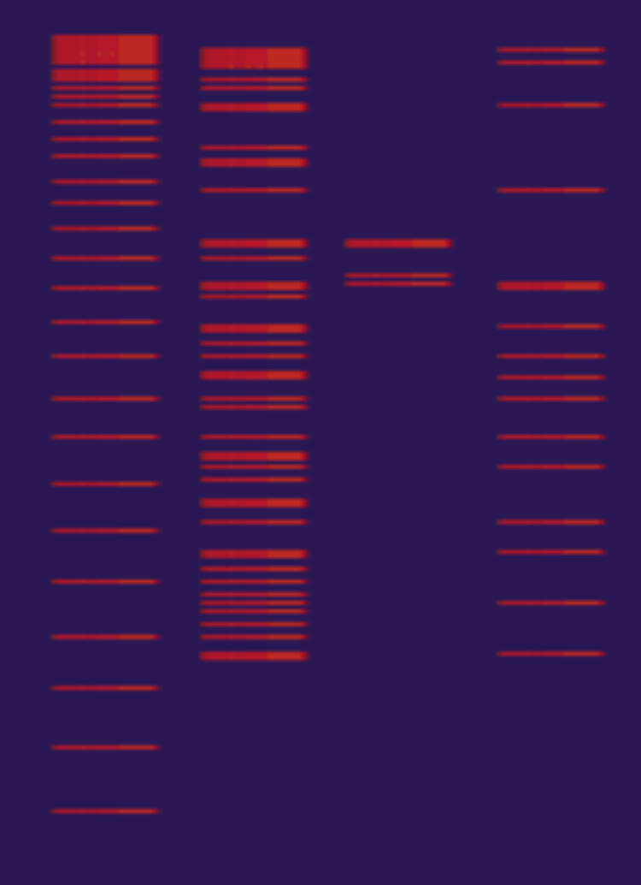

Jack Stob [Hittin' The Bars](https://jackelynstob.github.io/CreativeCoding1/hw-11/)

# HW-11 | Object Oriented Programming

## Fashionably Late?

I was under the impression our homework was due this past Thursday (my turkey deprived brain didn't think to check the emails/due date since my **phone broke** and **my laptop was in a different city**). Anyway, I'm here now and honestly *you're welcome.* No but seriously I do apologize for the late submission. Your grading is greatly appreciated!

## Gravy and Coding in my Blood

Not only did I manage to eat three Thanksgiving meals leading to my blood genuinely turning into gravy, but I got to work on this project with my pops! Since he is a programmer, he was interested on learning more about Atom and how p5.js uses Object Oriented Programming so we scheduled multiple meetings to work on this together. We thought it'd be fun to re-create this:

*(this is a screenshot of a gif, but the bars started at the top as one, and travelled down the screen, adding more bars each time).*

We figured out a lot of the base code together and together, we got to the point where we had the four bars on the screen, then our schedules didn't quite line up so the rest was up to me!! And boy was I up to the challenge (naively might I add). After initializing the move part of class Lanes() the bars moved vertically down the screen but didn't add new ones. I tried to figure out the way to do that, and it kind of worked! But the only issue is, it replaced the four bars with only one bar that repeated down the screen. To add to that, instead of staying stationary and just adding more until it filled the height of the screen, they still moved all down the screen and then disappeared. With a time crunch and also a slight feeling of discouragement, I assessed the situation and decided to change the end goal.

## The New Objective

This is where I have landed with my result! Keeping the multiple bars, I added more, and moved them down the screen at random speeds, I decided that instead of disappearing forever, the bars would bounce off the top and bottom. Also I added that when the bar hit the bottom of the screen it'd randomly change the color to any shade between black and white on the grey scale. I tried (and failed) to make it that when the bars hit the top of the screen they'd change back to red. Again, with the time crunch I just decided to scrap that idea.

## Results

My end product looks like this:
  1. light green background (still festive ayee)
  2. red bars across the screen
  3. the bars are moving down the screen vertically
  4. once the bars hit the bottom, they change directions to move vertically up the screen and changing different shades of grey
  5. voila!
