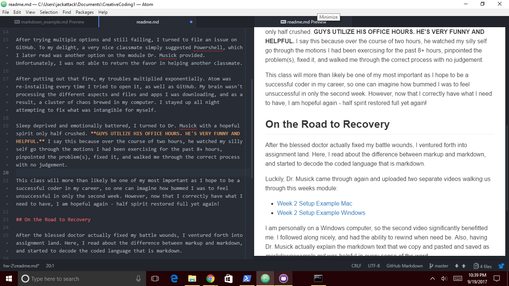

Jackelyn Stob 51

# HW-2 Response

## Trouble in Paradise

This week was very difficult for me. To begin, my Command Prompt was not my friend. I was denied access even after spending 2 hours looking on forums and watching youtube videos showing me how to grant myself access.
The code looked a little like this:

```command prompt
C:\Users\jackattack> nul>new-item
Access is Denied.
```

After trying multiple options and still failing, I turned to file an issue on GitHub. To my delight, a very nice classmate simply suggested Powershell, which I later read was another option on the module Dr. Musick provided. Unfortunately, I was not able to return the favor in helping another classmate.

After putting out that fire, my troubles multiplied exponentially. Atom was re-installing every time I tried to open it, as well as GitHub. My brain wasn't processing the different aspects and files and apps I was downloading, and as a result, a cluster of chaos brewed in my computer. I stayed up all night attempting to fix what was intangible for myself.

Sleep deprived and emotionally battered, I turned to Dr. Musick with a hopeful spirit only half crushed. **GUYS UTILIZE HIS OFFICE HOURS. HE'S VERY FUNNY AND HELPFUL.** I say this because over the course of two hours, he watched my silly self go through the motions I had been exercising for the past 8+ hours, pinpointed the problem(s), fixed it, and walked me through the correct process with no judgement.

This class will more than likely be one of my most important as I hope to be a successful coder in my career, so one can imagine how bummed I was to feel unsuccessful in only the second week. However, now that I correctly have what I need to have, I am hopeful again - half spirit restored full yet again!

## On the Road to Recovery

After the blessed doctor actually fixed my battle wounds, I ventured forth into assignment land. Here, I read about the difference between markup and markdown, and started to decode the coded language that is markdown.

Luckily, Dr. Musick came through again and uploaded two separate videos walking us through this weeks module:
 - [Week 2 Setup Example Mac](https://youtu.be/sS2E-YPrnkg)
 - [Week 2 Setup Example Windows](https://youtu.be/18uhnvWUuHQ)

I am personally on a Windows computer, so the second video significantly benefitted me. I followed along nicely, and had the ability to rewind when need be. Also, having Dr. Musick actually explain the markdown text that we copy and pasted and saved as _markdownexample.md_  was helpful in every sense of the word.

## You Can't Have a Rainbow Without a Little Rain

In descending order, my favorite parts about this week have been:

1. Learning markdown language, which I would love to learn more of
2. The feeling of victory I had after I pulled the all-nighter and Dr. Musick and I fixed the issues.
3. Working on this exact assignment because I get to apply the skills I just learned.

### Text Editor Screen Shot

