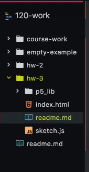
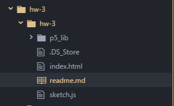

Jack Stob, 51

["Hello World!"](https://jackelynstob.github.io/CreativeCoding1/hw-3/hw-3/)

# I CAN SEE CLEARLY NOW, THE RAIN IS GONE

My oh my! What a 180 this week has been compared to the last (although I should have figured, Dr. Musick DID say that would happen.) This week we dove into p5.js, Hello World! and how to publish our codes online. *SHOUT OUT TO GITHUB FOR THE FREE STATIC URL THING.* Following along with the dizzity dope videos, I successfully managed to do all the work without having any major issues.

## WAIT, DID YOU FEEL A RAIN DROP? NOT AGAIN...

However, at one point, I did have a bit o' problem. After getting our URL from GitHub, we were to simply add 'hw-3/' onto the end of it, and, if we "successfully" completed step 1 of the hw, it should have refreshed to our Canvas without any issues.
But I had an issue.
BUT-BUT-BUT-I FOLLOWED ALL THE STEPS, I PROMISE!!

I went back to make sure the codes were correct, that I committed it on the GitHub app, and that I pushed it to the GitHub Repository (P.S. the lingo is still new but I feel like I just crushed that.)

  - check
  - check
  - check

Everything seemed correct so why was my little golden canvas that shouted "Hello World" nowhere to be found via the URL given to me?? I watched the video again, twice. I read the instructions, twice. So I did what any annoyed and pissed off person would do, and I deleted the entire hw-3 folder.
*She did what?!*
YEP. I started over. Scratched the project and built it back up. Okay, I'm being very dramatic considering I just copy and pasted the code into a word document until I got the folder back up (genuinely took maybe 10 minutes.) Once it was back up, I still had the same problem.

## LEARNING TO THRIVE IN THE RAIN

OK. Let's watch this video again for the fourth time. What are the clues?? Follow the steps:
  1. Duplicate the 'empty-examples' folder.
      - check.
  2. Rename the folder 'hw-3'
      - check.

**EUREKA!**
After closely looking at Dr. Musick's folder 'hw-3', I realized a difference. His folder looked like this:



While MY folder looked like this:



See the second folder I have? I unfortunately took this screenshot after I renamed that second folder, but before it said "empty-examples". So this means when I duplicated my "empty-examples" folder, I had an "empty-examples" folder inside of the first "empty-examples" folder. Confusing?? Yes. So I changed the name "empty-examples" (the second folder) to "hw-3". Then I tried again with the hw-3/ URL ending...no luck. So just for funsies, I added hw-3/hw-3/ (since there were two folders) NOW THIS IS THE **EUREKA!** moment. My URL is now up and running.

## LOVING THE STRUGGLE

As we all would love an easy-breezy homework assignment, I'm actually very thankful that I have struggled. This means I'm learning!! The feeling of being stuck is a bummer, but it makes the victorious moment that much better!! I'm very happy I didn't have an issue that brought me to needing to post an issue on GitHub, and I'm looking forward to being able to help a brother out when the time comes!

#### CONTINUING ON

The styling components are my favorite part, so I really loved learning how to make the color of the background - but nothing compares to the circle! The ellipse function is just a brief insight to the potential art that lies ahead and I am friggen stoked!!
 ```function setup(){
  ellipse( 20, 20, 20, 20 );
}```
