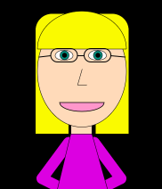

Jack Stob, 51

["Self-Portrait"](https://jackelynstob.github.io/CreativeCoding1/hw-4/)

# OH ME OH MY

I had extremely high expectations on what this self-portrait was going to look like, and let me tell you, this was not it! We all have some knowledge, but not an insane amount so far on how to code so I'm trying not to beat myself up. **But I thought I could do better.**

I did what I _could_, but I WILL DO BETTER. I am learning, and I am a work in process, as are my works... that are... in process... hehe.

# WHO'S THAT HOTTIE

Oh wait, that's me. KIDDING! But in all honesty this week was really great. Learning specific codes and how to portray what my brain is hoping to is a phenomenal feeling. Like I said, I don't _quite_ have the skills that I'm hoping to have, but it's fun to know I'm making progress! Out of a foreign language that COMPUTERS can understand, I - ME, created my own little version of myself. What a cool concept!

# The Journey That Is Me

My process was a bit untraditional. My original plan was to only do my face (I also thought my face was going to be more detailed), but I absolutely overshot my capabilities. This was mainly because I wanted to begin without any aid: as in, viewing the homework examples or watching the video Dr. Musick provided us of his walk through.
I'm sure if I had more time to work on this project, I could have gotten way closer to my goal but sadly, my life is controlled by much more than this class :(

SO, beginning with my face I REALLY quickly discovered this was much harder than I anticipated. No biggie though!
Just start with the obvious first steps:

- function setup ();     {
    createCanvas( 600, 1200 );  }

- function draw(); {
      background( 'rgb( 0, 0, 0 )' );
        }

Then came the masterpiece: **ME**
1. The ellipse function for my face
2. The arc function for my eyes
3. Then more of the arc function + CHORD for my bangs

This is the point where I realized I needed a body-and this is also where I realized my order of operations was out of whack. So while I am building, I am inserting new functions and instructions for my lil' lady. This is where I actually PRAISE JESUS HIMSELF for the ability to enter in the / / notes. SERIOUSLY, THANKS TO WHOEVER CREATED THAT.

# What Came Natural And What Didn't

Like my blue-green eyes, what did come natural for me were the more basic steps: the shapes, the colors, strokes, fills, etc.

Like my bright blonde hair, what didn't come natural were the harder steps: translate, rotate, and scale.

I think this was mainly because I didn't feel much of a need for them in _my_ specific piece. I had a hard time trying to find a spot for them.
The shapes and colors were used significantly more, so this gave me more of an opportunity to * master * this skill, while the others weren't * necessary * to make the artwork. What I landed on was that those were tools to make something _easier_ , but that there is a time and a place for those specific functions.

#### You Vs. The girl he tells you not to worry about

Okay if you guys haven't seen those memes, LOOK THEM UP, they're hilarious. I figured I'd let you all know what I hoped I would be able to create in comparison to what was actually made. If you're not giggling with me, KINDLY get off my read.me HAHA.

 VS 

Okay, obviously I knew it couldn't be THAT detailed, but this was around what I was hoping for. They say dream big, but dang!!
