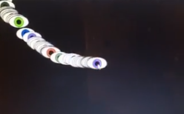
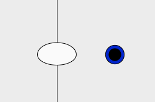

Jack Stob, 51
[Eye of the Beholder](https://jackelynstob.github.io/CreativeCoding1/hw-6/)

# This Is What Eye Am Talking About!

I am getting really excited with what we are learning about. I originally wanted to begin this assignment with random eyes popping up everywhere with the background changing in color. I wanted different sizes of the eyes and some closed and some open, but with the specifics of the assignment I altered it a bit.

# Where Eye Put the Assignment Specifics

  - **USE GLOBAL VARIABLES (HAVE AT LEAST ONE BE AN OBJECT):** At the top of my sketch.js, I have a list of variables, specifically global ones. My object is (var eye) which involves eye.pupilColor eye.width eye.topHeight eye.bottomHeight and eye.size.
  - **DEVISE ALGORITHMS WITH MATH OPERATORS AND FUNCTIONS:** There are two math operations and functions I use to create artwork over time:
    1. floor()
    2. contrain()
  The floor function I use with the random function in terms of colors, and I have it set to go up to 256, however there are only 255 colors, so I needed it to round down to the closest whole number since there aren't color values above 255. The contrain function I use to keep the sclera of the eye inside bounds and I let the iris and pupil leave those bounds. I thought this would be fun and would give a Halloween vibe with the holiday coming up!
  - **USE STANDARD MATH FUNCTIONS:** These standard math functions are in addition to the algorithms above.
    1. Addition/Subtraction was used in line 28 so that the right wall that constrains the sclera of the eye is always set at 100 less than the wdith.
    2. Multiplication was used in line 63. Honestly, I had this set at a specific number but for the sake of need a multiplication, I set a var to eye size and then multiplied it by 1.25 to get my desired iris size.
    3. Division was used in line 69 and is only there for the same reason multiplication is. I understand the usefulness of it, but my specific art project didn't exactly _need_ it.
    4. Modulo. OKAY I understand the math, I understand all of it but I'm not 100% clear on how to use it in coding. I was looking at the examples and I even tried to find some on the internet but it was still slightly above me. I used 9 % 3 when I need the number 0... hope this was right since that was my interpretation of it.
  - **USE AT LEAST ONE RANDOM NUMBER GENERATOR:** Here is where I had a hard time deciding if I wanted random colors or random eyes or both!! I couldn't exactly execute the random eyes efficiently since I had already decided that I wanted the one eye to follow my mouse and have a constrain. So I apted for the random colors for the iris and i am _pleased_  **pleased** PLEASED let me tell ya, with the outcome.
  - **USE A MAP FUNCTION AT LEAST ONCE:** Oh yes, this beautiful map function. This one was a bit hard for me to figure out initially, but it was very helpful when I decided to have the background change from black to white with the movement of the mouse. I definitely took this idea straight out of the overly-animated-man-that-makes-videos, but I dug it so I snatched that for my own.

## Sometimes Eye Get Confused

There were a few parts of this assignment that I realized I just had to *go with the flow* on, like how if I made a global variable too confusing, it wouldn't appear in the draw function, and thus made me declare it *inside* of the draw function. WHICH IS TOTALLY OKAY, I'll just have to research more as to why it has to be in there and what kinds of things work in/out of certain functions. I also really wanted to put another contrain for the height instead of just the width, but I struggled to find an equivalent to

    ``leftWall = 200;``

for

    ``topWall = 0, 200;``

I was successful in the bottom wall but without the top wall I didn't fully know how to constrain it, so I scratched that idea and kept it simple.

## Started From The Bottom Now Eye'm Here

I honestly just started this project and put some stuff on a page, then started to incorporate all of the details we needed to have in our homework. My intial project looked like first picture, but what I ended up with was the right picture:

 & 

To me, the first look is more aesthetically pleasing at first glance: the repeating eyes, the contrast against the dark color, etc. But when you actually look at the animation and effects of the final project, it's wicked cool that when the mouse moves from the left to the right the background changes color, and that the eye's iris and pupil actually LEAVE the eye when it hits certain bounds. Very hippy trippy.

###### Eye Received a Compliment

I showed somebody my final project and my beginning project and they said both would do well as trippy visuals and that I should consider going into that. I thought that was a rad comment!!! But also definitely **not** my calling.
